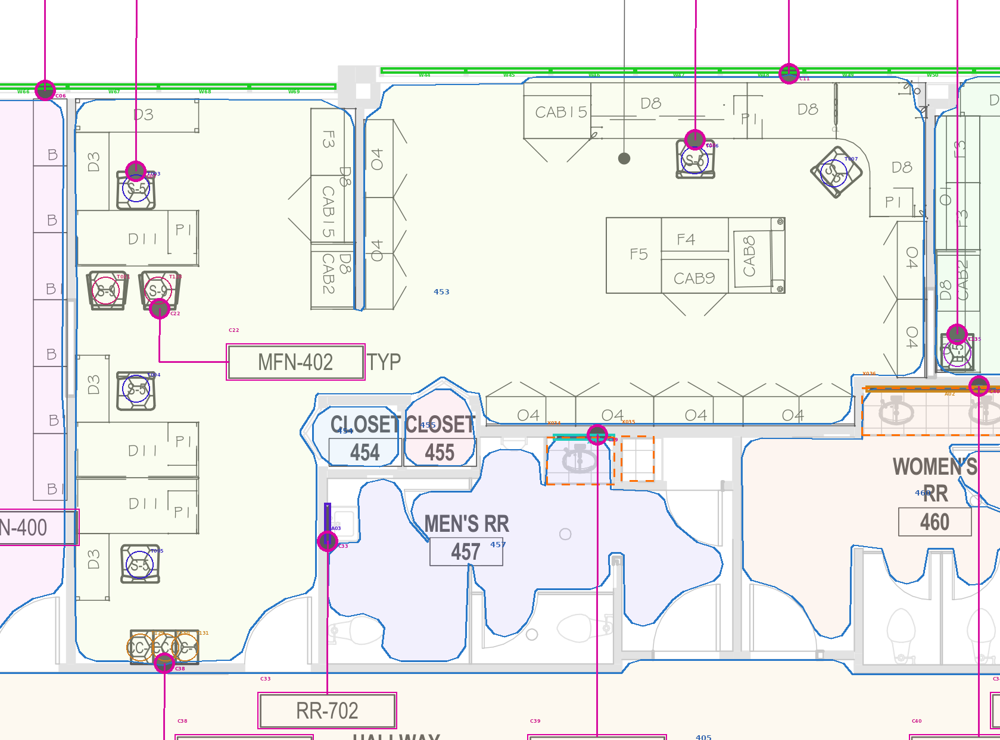
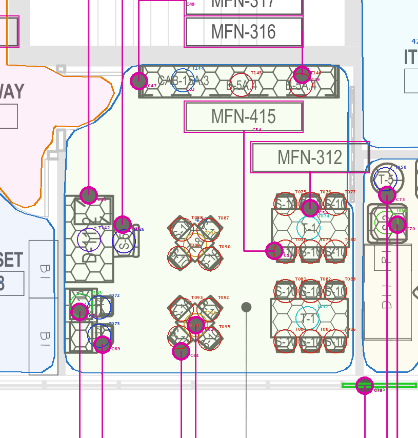
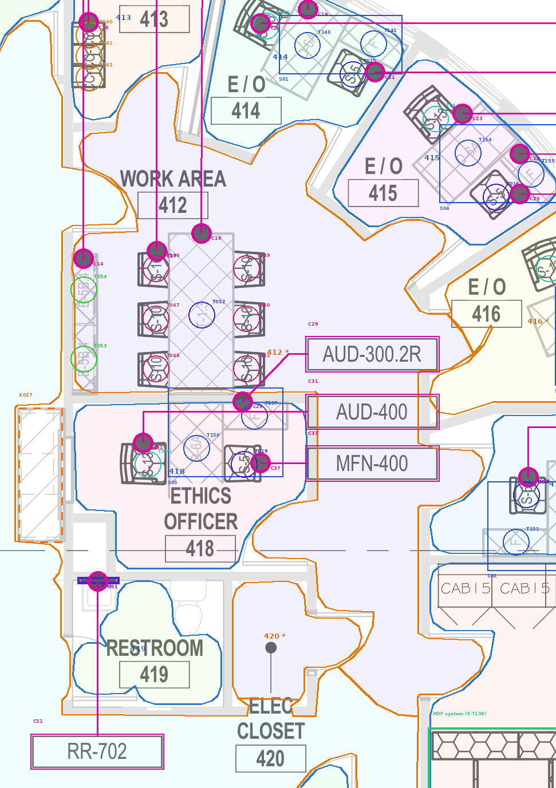
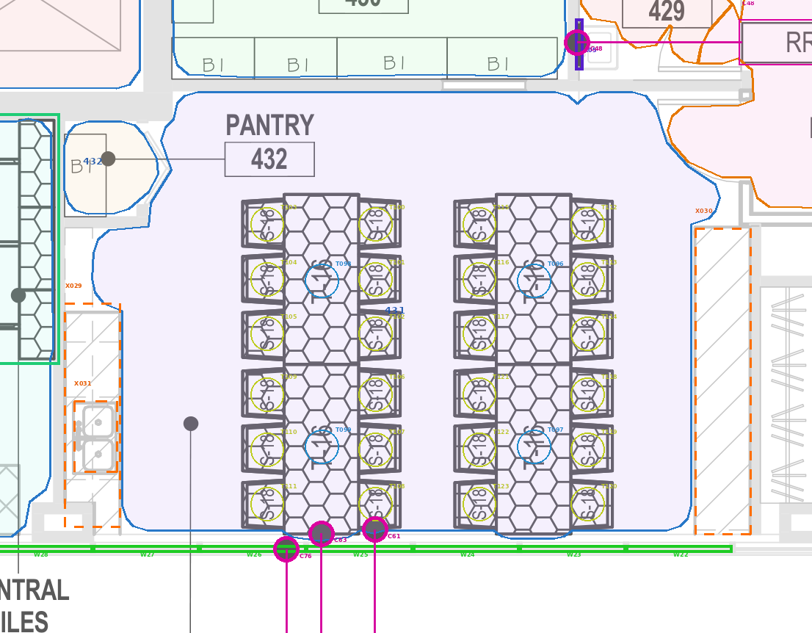
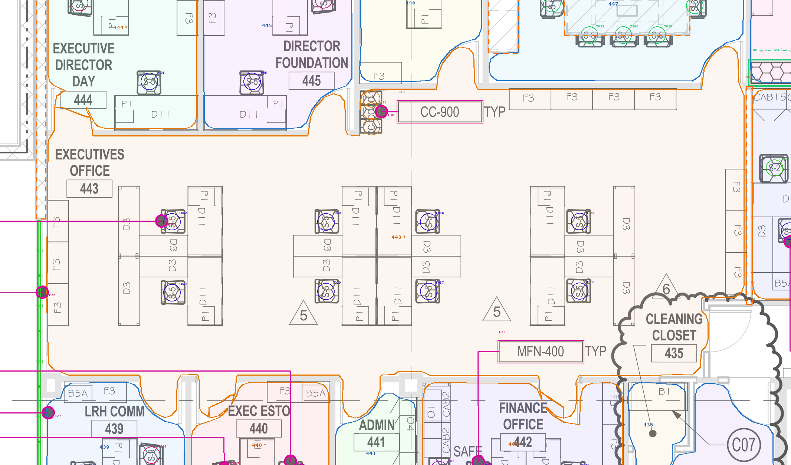
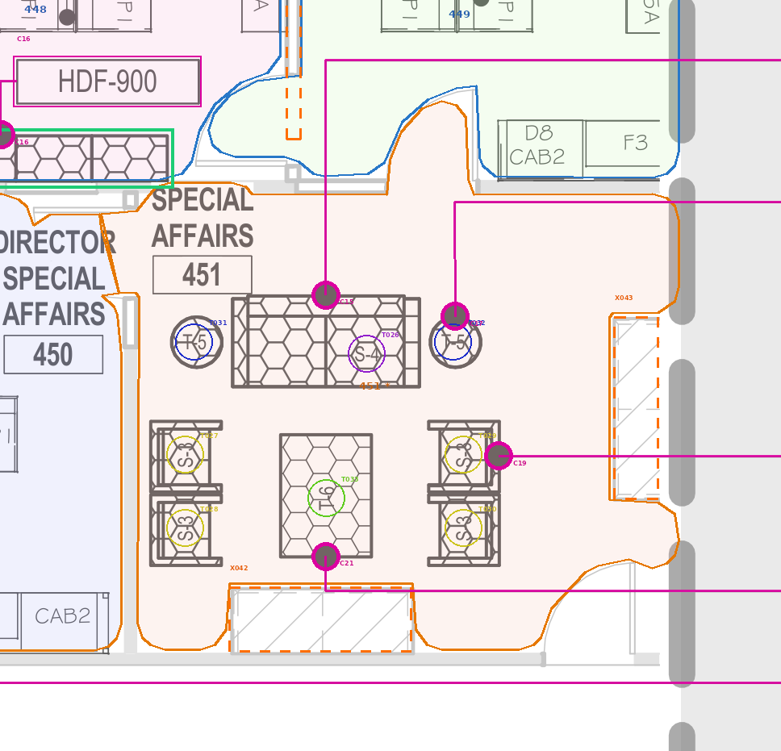

# Pilot rooms - interpretation check

Each close-up shows the traced leaders (magenta line, ring at the endpoint, Cnn = callout id), the room boundary used (blue = walls/doors, orange = inferred open-plan line) and every counted symbol ringed with its instance id (Tnnn, Wnn = glazing bay, Snn = assembly). Orange squares/dashed boxes are uncoded items (see exceptions).

## 453 PROMOTION & MARKETING - A06.04A (east)

| Row | Code | TYP | Symbol identified | Qty | Unit | Callouts | Confidence | Status |
|---|---|---|---|---|---|---|---|---|
| R062 | CC-900 | no | CC-1 (9x13 pt) | 3 | each | E-C38 | High | Plan count checked; awaiting model comparison |
| R063 | MFN-400 | TYP | S-5 (15x15 pt) | 5 | each | E-C07, E-C10 | High | Plan count checked; awaiting model comparison |
| R064 | MFN-402 | TYP | S-9 (14x15 pt) | 2 | each | E-C22 | High | Plan count checked; awaiting model comparison |
| R065 | WTR-500 | TYP | glazing bay (pane E-W48) | 10 | glazing bay | E-C11 | Medium | REVIEW - unit of measure unconfirmed |

Exceptions in this room: X008 Glazing bay straddles a partition; X056 Code label without TYP; repeated symbols counted

## 427 CLASS ROOM - A06.04A (east)

| Row | Code | TYP | Symbol identified | Qty | Unit | Callouts | Confidence | Status |
|---|---|---|---|---|---|---|---|---|
| R042 | MFN-312 | no | T-1 (36x18 pt) | 2 | each | E-C54 | Low | REVIEW - probable target adopted by rule |
| R043 | MFN-313 | no | T-8 (18x18 pt) | 2 | each | E-C62 | High | Plan count checked; awaiting model comparison |
| R044 | MFN-314 | no | D-11.2 (23x40 pt) | 1 | each | E-C43 | High | Plan count checked; awaiting model comparison |
| R045 | MFN-315 | no | D-4.1A (15x30 pt) | 1 | each | E-C74 | High | Plan count checked; awaiting model comparison |
| R046 | MFN-316 | no | B-5A.4 (93x15 pt) | 2 | each | E-C49 | High | Plan count checked; awaiting model comparison |
| R047 | MFN-317 | no | CAB-15A.3 (93x15 pt) | 1 | each | E-C47 | High | Plan count checked; awaiting model comparison |
| R048 | MFN-400 | no | S-5 (12x15 pt) | 1 | each | E-C45 | High | Plan count checked; awaiting model comparison |
| R049 | MFN-415 | no | S-10 (12x12 pt); S-10 (9x7 pt) | 20 | each | E-C53, E-C64 | High | Plan count checked; awaiting model comparison |
| R050 | MFN-416 | no | S-14 (7x10 pt) | 2 | each | E-C69 | High | Plan count checked; awaiting model comparison |

Exceptions in this room: X002 Leader endpoint on shared edge (probable target adopted); X045 Window bays without WTR-500 leader in room; X051 Code label without TYP; repeated symbols counted; X052 Code label without TYP; repeated symbols counted; X053 Code label without TYP; repeated symbols counted; X054 Code label without TYP; repeated symbols counted; X055 Code label without TYP; repeated symbols counted

## 412 WORK AREA - A06.04A (east)

| Row | Code | TYP | Symbol identified | Qty | Unit | Callouts | Confidence | Status |
|---|---|---|---|---|---|---|---|---|
| R010 | CRM-301.3 | no | T-1.3 (27x67 pt) | 1 | each | E-C18 | High | Plan count checked; awaiting model comparison |
| R011 | CRM-325 | no | B-5B.4 (9x27 pt) | 2 | each | E-C14 | High | Plan count checked; awaiting model comparison |
| R012 | CRM-400 | TYP | S-10 (13x15 pt) | 6 | each | E-C17 | High | Plan count checked; awaiting model comparison |

Exceptions in this room: X048 Code label without TYP; repeated symbols counted; X065 Room boundary inferred (open plan / no door)

## 431 LUNCH ROOM - A06.04A (east)

| Row | Code | TYP | Symbol identified | Qty | Unit | Callouts | Confidence | Status |
|---|---|---|---|---|---|---|---|---|
| R052 | DIN-301 | TYP | T-16 (24x55 pt) | 4 | each | E-C63 | High | Plan count checked; awaiting model comparison |
| R053 | DIN-400 | TYP | S-18 (14x16 pt) | 24 | each | E-C61 | High | Plan count checked; awaiting model comparison |
| R054 | WTR-500 | TYP | glazing bay (pane E-W26) | 6 | glazing bay | E-C76 | Medium | REVIEW - unit of measure unconfirmed |

Exceptions in this room: X029 Untagged item (no in-symbol tag, no code); X030 Untagged item (no in-symbol tag, no code); X031 Untagged item (no in-symbol tag, no code)

## 443 EXECUTIVES OFFICE - A06.04B (west)

| Row | Code | TYP | Symbol identified | Qty | Unit | Callouts | Confidence | Status |
|---|---|---|---|---|---|---|---|---|
| R101 | CC-900 | TYP | CC-1 (14x9 pt) | 3 | each | W-C18 | High | Plan count checked; awaiting model comparison |
| R102 | MFN-400 | TYP | S-5 (15x15 pt) | 8 | each | W-C20 | High | Plan count checked; awaiting model comparison |
| R103 | WTR-500 | TYP | glazing bay (pane W-W01) | 3 | glazing bay | W-C22 | Medium | REVIEW - unit of measure unconfirmed |

Exceptions in this room: X072 Room boundary inferred (open plan / no door)

## 451 SPECIAL AFFAIRS - A06.04B (west)

| Row | Code | TYP | Symbol identified | Qty | Unit | Callouts | Confidence | Status |
|---|---|---|---|---|---|---|---|---|
| R121 | MFN-305 | TYP | T-5 (15x15 pt) | 2 | each | W-C17 | High | Plan count checked; awaiting model comparison |
| R122 | MFN-306 | no | T-6 (27x36 pt) | 1 | each | W-C21 | High | Plan count checked; awaiting model comparison |
| R123 | MFN-410 | TYP | S-3 (21x21 pt) | 4 | each | W-C19 | High | Plan count checked; awaiting model comparison |
| R124 | MFN-412 | no | S-4 (56x27 pt) | 1 | each | W-C15 | High | Plan count checked; awaiting model comparison |

Exceptions in this room: X042 Untagged item (no in-symbol tag, no code); X043 Untagged item (no in-symbol tag, no code); X075 Room boundary inferred (open plan / no door)

